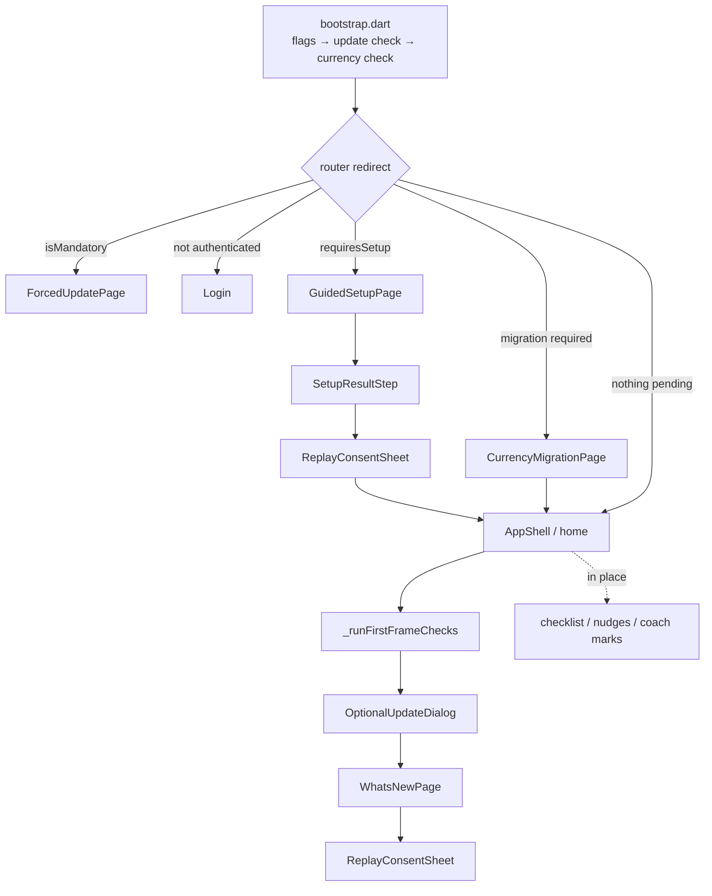

# Interruptions

Everything the app puts *in front of* a user who did not ask for it: blocking
routes, dialogs, bottom sheets, coach marks and home cards, triggered by an
account being old, by data predating a feature, or by a consent question that
has never been answered.

They are documented together because they compete for the same two resources —
the root navigator and the user's patience — and because the rules that keep
them from stacking live in four different files.

## The catalogue

| Surface | Form | Trigger | Who sees it | Dismissal | Where the answer lives |
|---|---|---|---|---|---|
| [`ForcedUpdatePage`](../features/app_update/presenter/pages/forced_update_page.dart) | Blocking route `/forced-update` | `appUpdateController.isMandatory` (Remote Config thresholds) | Anyone below the minimum version | None — `PopScope(canPop: false)` | Nothing; re-evaluated every launch |
| [`GuidedSetupPage`](../features/onboarding/presenter/pages/guided_setup_page.dart) | Blocking route `/onboarding` | `segment.requiresSetup` (`fresh` / `stalled`) | ≤1 registered service and no resolved setup | Close button → `markSkipped` | `users/{uid}` setup flag |
| [`CurrencyMigrationPage`](../features/settings/presenter/pages/currency_migration_page.dart) | Blocking route `/currency-migration` | `CurrencyMigrationState.isRequired` | Has data, no `currencyMigratedAt` | None — `PopScope(canPop: false)` | `users/{uid}.currencyMigratedAt` |
| [`OptionalUpdateDialog`](../features/app_update/presenter/widgets/optional_update_dialog.dart) | `KaziDialog`, `barrierDismissible: false`, root navigator | `shouldShowOptionalDialog()` | Behind the recommended version | "Later" | Nothing; may return next launch |
| [`WhatsNewPage`](../features/onboarding/presenter/pages/whats_new_page.dart) | Full-screen dialog route, root navigator | Stored version ≠ current version | `active` segment only | The single CTA | Local `whatsNewSeenVersion` |
| [`ReplayConsentSheet`](../features/onboarding/presenter/widgets/replay_consent_sheet.dart) | Modal bottom sheet, root navigator | `PrivacySettings.needsReplayPrompt` | Anyone who never answered | Accept / Decline — **swipe is not an answer** | Local `sessionReplayConsent` |
| [`PaywallView`](../features/subscription/presenter/widgets/paywall_view.dart) | Modal | `FreemiumGuard` blocks a creation, via `PaywallPromptController` | Free tiers over a limit — `churned` hits 0 immediately | Close | Nothing; fires again on the next blocked action |
| [`OnboardingChecklistCard`](../features/onboarding/presenter/widgets/onboarding_checklist_card.dart) | In-place card on the home | `hasResolvedSetup`, not finished, <10 services | Users the setup ran for | Self-removes when finished | `users/{uid}.completedOnboardingSteps` |
| [`ActiveUserNudges`](../features/onboarding/presenter/widgets/active_user_nudges.dart) → cycle | In-place card on the home | `!settings.hasExplicitBillingCycle` | `active` segment | Dismissible **per session** | `users/{uid}` billing cycle |
| `ActiveUserNudges` → commission gaps | In-place card on the home | Catalog items with `effectiveCommissionPercent == null` | `active` segment | Dismissible **per session** | The items themselves |
| [`KaziCoachMark`](../../../kazi_core/lib/shared/components/coach_mark/kazi_coach_mark.dart) ×4 | Anchored bubble | First time the anchored widget is on screen — [see below](#coach-marks) | Anyone who has not seen that hint | "Got it", or retracted when the anchor leaves | Local, one key per `OnboardingHint` |
| Store review sheet | Native (Play / StoreKit) | ≥20 creation actions + age rules | Once per install | Native | Local — see [in_app_review/README.md](../../../kazi_core/lib/shared/services/in_app_review/README.md) |

The menu is the permanent counterpart to the interrupting versions: Menu ›
Privacy carries both consent switches and the policy, Menu › Preferences
carries the currency and the billing cycle. Every question asked by an
interruption can be revisited there — which is what allows all of them to be
asked exactly once.

## Order of appearance

Two orderings are load-bearing:

- **The router gates are a precedence chain**, in [`kazi_router.dart`](../../../kazi_core/lib/shared/navigation/kazi_router.dart):
  forced update outranks auth, auth outranks onboarding, onboarding outranks
  the currency migration. The migration is last because it needs a uid and must
  not interrupt someone still creating their account.
- **The first-frame chain in [`app_shell.dart`](../app_shell.dart) is strictly
  sequential** (`await`, remount-checked). All three want the root navigator,
  and two arriving together is how someone dismisses something they never read.

`ReplayConsentSheet` has two call sites that are mutually exclusive in practice:
[`SetupResultStep`](../features/onboarding/presenter/widgets/setup_result_step.dart)
for accounts the setup ran for, and the shell chain for everyone else — the
`active` and `done` segments, which is to say the long-standing users. Both go
through `askIfNeeded`, a no-op once the question has been answered.

## Coach marks

Four hints, each teaching one thing where that thing actually is. The pieces:
[`OnboardingHint`](../features/onboarding/domain/models/onboarding_hint.dart)
is the catalogue (title, body and storage key),
[`HintAnchor`](../features/onboarding/presenter/widgets/hint_anchor.dart) wraps
the widget being pointed at and owns every rule below,
[`HintController`](../features/onboarding/presenter/controllers/hint_controller.dart)
answers "is this one still owed", and
[`KaziCoachMark`](../../../kazi_core/lib/shared/components/coach_mark/kazi_coach_mark.dart)
in kazi_core draws it. Call sites carry nothing but the `HintAnchor` wrapper.

| Hint | Anchored to | Where | Extra condition (`enabled`) |
|---|---|---|---|
| `fab` | The shell's floating action button | [`app_shell.dart`](../app_shell.dart) → `_ShellFab` | Home tab only — on any other tab the same button creates something else |
| `markReceived` | The "mark as received" footer button | [`service_details_page.dart`](../features/services/presenter/pages/service_details_page.dart) | The service is not already received |
| `filters` | The filter icon button | [`service_navbar.dart`](../features/services/presenter/widgets/service_navbar.dart) | ≥`_hintMinimumServices` services — a history worth filtering |
| `summary` | The "summary" segment of the view switch | [`service_view_switch.dart`](../features/services/presenter/widgets/service_view_switch.dart) | The summary is not the open view |

Each is shown once per install and remembered in **local storage**, one key per
value — so signing out (which clears storage) offers them again, on purpose.
Any tap dismisses the bubble, including one aimed at the screen behind it, and
a dismissal is what writes the key: a hint can be spent without being read. In
debug builds, Menu › Debug › **Reset coach marks** clears the four keys with no
restart and nothing else touched.

### The slot

Only one bubble is up at a time. The slot is claimed the instant before showing
— synchronously, so two anchors mounting on the same frame cannot both win —
and freed as soon as it comes down. It is **not** held for the rest of the
session: the home teaching the FAB must not cost the services tab its own hint
minutes later.

What differs is the bookkeeping. "Got it" writes the key and the hint never
returns. Everything else that takes a bubble down — the user changing tab,
`enabled` flipping, the anchor being disposed — is a **retraction**: the mark
is hidden and the slot freed, but nothing is written, so the hint is offered
again the next time its anchor is in front of the user. A hint burned on a
bubble nobody could act on is a hint the user never gets.

An anchor asks for the slot when it mounts, when it is revealed, and when
`enabled` turns on — never on a plain rebuild. That is what keeps two hints
living on the same screen (`filters` and `summary`) from firing one after the
other: the loser waits for the next visit rather than pouncing on the winner's
dismissal.

Three things make "in front of the user" true, and none of them is `mounted`:

- **`TickerMode`.** go_router keeps inactive shell branches laid out and
  measurable, so an anchor on another tab still measures fine. Its ticker mode
  is what says the user is looking elsewhere.
- **`ModalRoute.isCurrent`**, for an anchor under a pushed page.
- **A re-check after every `await`.** `startupSettled` and the storage read both
  suspend, and the user can change tab in between — the conditions are asked
  again on the other side, not captured before.

### The mark

It never paints over its anchor: the scrim is a path with the anchor's rounded
rect subtracted, ringed in `brand.fill`. Filling that shape would hide the very
thing the bubble is describing. The anchor is re-measured every frame, so the
ring follows it instead of marking where it used to be.

The ring repeats the anchor's **own** shape, and only the anchor knows it:
`HintAnchor.radius` defaults to a stadium — right for the FAB, the pill and the
icon button — and a squarer anchor passes its radius, or it gets ringed as a
pill it is not.

## Segments

[`OnboardingSegment`](../features/onboarding/domain/models/onboarding_segment.dart)
is the single answer to "how old is this account", derived once per session from
the setup flag plus the service count (`≥2` = `active`).

| Segment | Setup | Checklist | Nudges | What's new |
|---|---|---|---|---|
| `fresh` / `stalled` | blocking | after it resolves | no | no |
| `active` | never | no | yes | yes |
| `done` | no | if the setup once ran | no | no |

The split exists so nothing ever tells an existing user the app has no idea who
they are — a "build your catalog" checklist on the home of someone with forty
services is worse than showing them nothing at all.

## Consent

The two questions have deliberately different shapes, because their legal
footing differs (see [`privacy_settings.dart`](../features/settings/domain/models/privacy_settings.dart)):

- **Usage analytics** — legitimate interest, so it records an *objection*:
  `analyticsOptOut` is a plain `bool`, on by default, switchable in the menu.
  Never asked in a modal.
- **Session replay** — asked for, so `sessionReplayConsent` is **nullable**.
  `null` means "not yet put" and is never read as a yes; only an explicit
  answer stops the sheet returning, which is why a swipe-away leaves it `null`
  and writing `false` matters as much as writing `true`.

Both live in **local storage, not on the account document**: signing out calls
`storage.clear()`, so the next person on the device is asked for themselves
instead of inheriting a stranger's yes. The same clear resets the what's-new
marker, every coach mark and the store-review flag — a signed-out-and-back-in
user is treated as a new device, on purpose.

Consent reaches the SDKs through `bootstrap.dart`: `_startAnalytics` at launch,
`analyticsConsentSync` for later changes made in the menu. See
[analytics/README.md](services/data/analytics/README.md).

## Rules for adding another one

1. **Fail open.** Every check here is wrapped so that a failure means *do not
   interrupt* — `OnboardingController` returns `done`, `CurrencyMigrationController`
   returns `done`, `WhatsNewController` returns `false`, `HintController` returns
   `false`. A network blip costs the prompt, never the app; it is asked again
   next launch.
2. **The flag that closes the gate is written last.** `markCompleted`,
   `markCurrencyMigrated` and `markSeen` all run after the work they guard, so
   an interrupted run reappears and skips what it already did.
3. **Blocking is a claim about correctness, not importance.** The currency
   migration blocks because every total behind it sums unlike quantities; the
   commission gaps only distort one number, so they are a dismissible card.
4. **Ask once, and leave a permanent home for the answer in the menu.** An
   interruption with no menu counterpart cannot be asked once.
5. **Anything modal joins the sequential chain in `app_shell.dart`.** Do not
   show it from a page's `initState` in parallel with it.
6. **Check the segment before writing the card.** `isActiveUser` /
   `hasResolvedSetup` are the two gates that keep new-user surfaces off an
   existing user's home.

## Tests

| Behaviour | Test |
|---|---|
| Gate precedence and redirects | `test/flows/startup_redirect_flow_test.dart` |
| Consent shapes and persistence | `test/lib/features/settings/.../privacy_controller_test.dart` |
| Migration order and resumption | `test/lib/features/settings/.../currency_migration_controller_test.dart` |
| Update thresholds | `test/lib/features/app_update/...` |
| Paywall on a blocked creation | `test/flows/freemium_paywall_flow_test.dart` |
| Setup write order | `test/lib/features/onboarding/.../guided_setup_controller_test.dart` |
| Coach mark slot, retraction and the uncovered anchor | `test/lib/features/onboarding/.../hint_anchor_test.dart` |
| Which hint each screen raises, on the real router | `test/flows/coach_mark_flow_test.dart` |
