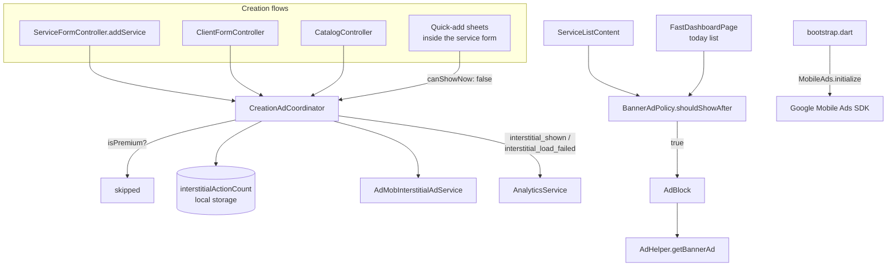

# Ads

Two ad formats, one rule that governs both: **a premium user never sees an ad.**
The single check is `isPremiumProvider`; neither policy object below queries the
subscription service directly.

| | Interstitial | Banner |
|---|---|---|
| Format | Full-screen, dismissible | `AdSize.largeBanner` (320×100) |
| Trigger | After a successful creation | Inline in the service list and the home's today list |
| Rule object | [`CreationAdCoordinator`](creation_ad_coordinator.dart) | [`BannerAdPolicy`](banner_ad_policy.dart) |
| Rate | Every **3** creation actions | After every **3** list items; after the last one of a shorter list |
| Remote Config key | `interstitial_ad_frequency` | `banner_ad_frequency` |
| Ad unit (`.env.<flavor>`) | `SERVICE_CREATE_ANDROID` / `_IOS` | `SERVICE_LIST_ANDROID` / `_IOS` |

Both rates are read from Firebase Remote Config and fall back to a code default
of **3** when the key is unset, non-numeric, or `<= 0`. Both defaults are also
declared in `RemoteConfigKeys.defaults` — Remote Config's `setDefaults` replaces
its map wholesale, so a key missing there is a key that reads as zero.

---

## Where the pieces live

| File | Role |
|---|---|
| [`creation_ad_coordinator.dart`](creation_ad_coordinator.dart) | Counts creation actions, decides when the interstitial shows |
| [`banner_ad_policy.dart`](banner_ad_policy.dart) | Pure `shouldShowAfter(position, total:)` |
| [`admob_interstitial_ad_service.dart`](admob_interstitial_ad_service.dart) | Preload / show / re-preload lifecycle |
| [`../../domain/interstitial_ad_service.dart`](../../domain/interstitial_ad_service.dart) | The interface both the app and the tests speak to |
| [`core/widgets/ads/ad_block.dart`](../../../widgets/ads/ad_block.dart) | Owns one `BannerAd` per mounted list row |
| [`core/utils/ad_helper.dart`](../../../utils/ad_helper.dart) | Builds the `BannerAd` and its listener |
| [`injector.dart`](../../../../injector.dart) | Wires all three as `keepAlive` providers |

---

## Interstitial

A **creation action** is one successful write of a client, a catalog item, or a
service. Each one increments a counter persisted in local storage
(`interstitialActionCount`); the ad shows once that counter reaches the
frequency.

Four details that are easy to get wrong when touching this:

- **A service form save is one action, whatever its quantity.** Saving the form
  with quantity 3 writes three services but counts once.

- **Quick-adds count but never interrupt.** The client and catalog-item sheets
  inside the service form call `onCreationAction(canShowNow: false)` — the user
  is mid-form, and a full-screen ad there loses their input. The action still
  increments, so it counts toward the next eligible show.
- **The counter only resets when an ad actually rendered.** `showIfAvailable()`
  returns `false` when nothing is preloaded; the count is kept so the next
  eligible action retries instead of waiting a full cycle.
- **Nothing here can fail a creation.** The whole body is wrapped — a storage
  error, a Remote Config error, or an SDK error is logged and swallowed. The
  service the user just saved is already saved.

**Loading is started ahead of the save.** An interstitial takes seconds to load,
and one that has not landed when the counter reaches the frequency shows
nothing — which, with a lazily built provider, used to swallow the first
eligible ad of every app launch. So the coordinator preloads at two moments,
both skipped for premium users: `prepare()` when the service form opens to
create, and after every action that stays below the frequency (which covers the
client and catalog flows). `AdMobInterstitialAdService` itself never loads at
construction; it re-preloads on dismissal or show-failure, and detaches `_ad`
before calling `show()`, so two concurrent calls cannot show the same ad twice.

Both outcomes are reported to analytics as `interstitial_shown` /
`interstitial_load_failed` — deliberately from the coordinator rather than from
the SDK callbacks, because the question being answered is about the app (how
much advertising a free user actually absorbs per session), and a failed load is
half of that answer.

### Effective rate

The counter is shared across all three creation types, so the interstitial is
**not** "every 3 services" — it is every 3 creations of any kind. A user adding
a client, a catalog item and then a service sees it on the service. Quick-adds
inside the form count too, so a form that quick-adds a client and saves one
service reaches 2 on its own.

---

## Banner

`shouldShowAfter(position, total:)` places a banner **after** every
`frequency`th item — positions 2, 5, 8, … with the default of 3 — and after the
last item when the whole list is shorter than the frequency, so a free user with
one or two services still sees one. An empty list carries none, and the first
thing on the screen is never an ad.

`position` and `total` describe the **whole list on screen**, not the slice a
widget renders. The services tab groups rows by day, one `ServiceList` per day;
`ServiceListByDate` hands each day the position its rows start at and the
overall total. Counted per day instead, every day with fewer than three services
would carry a banner of its own.

| Where | Rows | Banner spacing | Corners |
|---|---|---|---|
| Services tab (`ServiceListContent`) | `ServiceCard`, `KaziRadii.sm` | `padding: top xs` — the list's separator spaces it below | `KaziRadii.smBorder` |
| Home today list (`FastDashboardPage`) | `TodayServiceCard`, `KaziRadii.md` | `padding: bottom sm` — the card theme's bottom margin spaces it above | `KaziRadii.mdBorder` |

In both, the banner sits as far from the row above as from the row below, and is
clipped to the radius of the cards around it. Both placements use the
`SERVICE_LIST_*` ad unit.

`AdBlock` **owns the ad's lifecycle**: one `BannerAd` is created and loaded in
`initState` and disposed in `dispose`. This is not incidental. Building the ad
inside `build()` — as an earlier version did — issues a fresh ad request every
time the row scrolls back into view and leaks every ad it replaces. AdMob reads
that pattern as invalid traffic.

For the same reason the block **keeps itself alive**
(`AutomaticKeepAliveClientMixin`). The services tab builds its rows lazily, and
a lazy list disposes a row that scrolls out of view — without the keep-alive,
scrolling back would dispose and request the ad all over again. In a plain
`Column`, like the home's today list, the keep-alive is inert.

The block **requests and reveals the ad only while the list is at rest**. Both
steps run on the platform's main thread — creating the native banner, and
inserting its platform view — and on Android that thread also delivers touches,
so doing either mid-scroll stalls the gesture; a banner appearing mid-scroll
also jolts the rows under the finger. `AdBlock` listens to the enclosing
`Scrollable`'s `isScrollingNotifier`: it requests the ad the first moment the
list is idle, and appends the banner at the first idle moment after it loads.
The block is a `Column` from the start, so the row above the banner is never
remounted when it arrives.

The banner's `ClipRRect` is a per-frame cost while it is on screen: a platform
view clipped to rounded corners is composited with a mask on every frame. If
profiling shows banners costing frames, the corners are the first thing to give
up.

The block renders **nothing** until `onAdLoaded` fires: an empty slot reads as a
broken row, and reserving height for an ad that never arrives is dead space in
the list. The `SizedBox` takes its dimensions from `ad.size`, never a hard-coded
height — a container smaller than the creative makes the SDK refuse to render
it.

In the services tab `AdBlock` wraps the swipeable row, not the bare card, so the
row above a banner keeps swipe-to-toggle like any other.

---

## Setup outside the code

| | Android | iOS |
|---|---|---|
| App id | `ADMOB_APPID` in `key.properties`, injected as a `resValue` per build type, read by `AndroidManifest.xml` | **Not configured** — no `GADApplicationIdentifier` in `Info.plist` |
| Ad units | `.env.<flavor>` | `.env.<flavor>` |
| SKAdNetwork | n/a | **Not configured** |

The `prod_test` flavor exists precisely so production configuration can be run
against test ad units; its `.env.prod_test` carries Google's test unit ids.

`TEST_DEVICE_IDS` is a comma-separated list of AdMob device ids, applied by
`_initializeAds` in [`bootstrap.dart`](../../../bootstrap.dart) via
`updateRequestConfiguration` **before** `MobileAds.instance.initialize()`. Those
devices are served Google's test creatives on every unit, real ad units
included, so exercising creation flows on a dev device is not counted as real
traffic.

Get the id from logcat/Xcode on the first ad request — the SDK prints
`Use RequestConfiguration.Builder().setTestDeviceIds(...)` with the hash — and
add it to each `.env.*` you run on. An empty or absent value means every request
from that build is real; that is what the `prod_test` flavor is the fallback
for.

---

## Testing

`BannerAdPolicy` and `CreationAdCoordinator` are pure enough to unit-test
directly ([`test/lib/core/services/data/ads/`](../../../../../test/lib/core/services/data/ads)) —
that is the reason the rules are objects rather than `if`s inside widgets. The
SDK-facing halves (`AdMobInterstitialAdService`, `AdBlock`) are not covered:
they need a real `MobileAds` binding.
