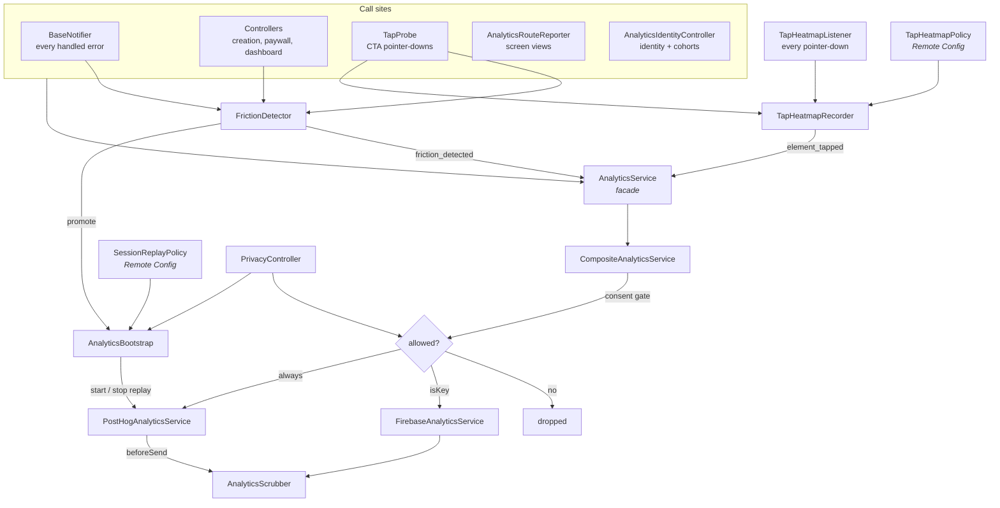

# Analytics

Two destinations behind one interface, answering two questions: **where is the
user's bottleneck**, and **why do people leave**.

| | Firebase Analytics | PostHog (EU Cloud) |
|---|---|---|
| Receives | Key events only (7) | The whole taxonomy (48) |
| Exists for | Play Console, Google Ads, Firebase audiences | Funnels, retention, cohorts, session replay |
| Why limited | It feeds Play Console, Ads and Audiences — not analysis. Every parameter worth slicing spends one of 50 event-scoped custom dimensions, and those never backfill | No such caps |

Both get the **Firebase Auth uid** as `distinctId`, so a PostHog funnel and a
Firebase audience describe the same person.

`isKey` filters `log()` and nothing else. Screen views, `identify` and user
properties reach both sinks unfiltered.

---

## Flow

---

## Files

### `lib/core/services/domain/`

| File | Role |
|---|---|
| `analytics_service.dart` | The facade every caller depends on. Five methods: `log`, `screen`, `identify`, `setUserProperties`, `reset`. |
| `analytics_event.dart` | The taxonomy — 48 events with their parameters. `isKey` routes an event to Firebase as well. |
| `friction_kind.dart` | The four shapes of "this person is struggling". |

### `lib/core/services/data/analytics/`

| File | Role |
|---|---|
| `composite_analytics_service.dart` | Fans one call out to both sinks and applies the consent gate. The only place that knows there are two. |
| `firebase_analytics_service.dart` | Firebase sink. Coerces booleans to `1`/`0` and validates property names. |
| `posthog_analytics_service.dart` | PostHog sink, plus SDK setup and the replay start/stop controls. |
| `analytics_scrubber.dart` | Removes personal data from properties on the way out. Pure. |
| `analytics_bootstrap.dart` | Decides per launch whether the session is measured and recorded. |
| `session_replay_policy.dart` | The sampling rule, read from Remote Config. Pure. |
| `tap_heatmap_policy.dart` | Whether this session contributes taps, and how many. Pure. |
| `tap_heatmap_recorder.dart` | Turns pointer-downs into `element_tapped`, pairing a position with the control it hit. Pure. |
| `friction_detector.dart` | Recognises a struggling user and promotes the session to being recorded. Pure, clock-injected. |
| `analytics_identity_controller.dart` | Keeps identity and cohort attributes in sync. Riverpod, `keepAlive`. |
| `analytics_route_reporter.dart` | One screen view per navigation. Riverpod, `keepAlive`. |

### Elsewhere

| File | Role |
|---|---|
| `core/widgets/tap_probe.dart` | Wraps a CTA; feeds the rage-tap signal and names the tap for the heatmap. |
| `core/widgets/tap_heatmap_listener.dart` | Mounts the recorder over the whole app, from `MaterialApp.builder`. |
| `features/settings/.../tap_heatmap_page.dart` | Debug-only view of this device's own captured taps. |
| `core/routes/current_screen.dart` | Resolves the current `AppPage` name for event attribution. |
| `core/utils/base_notifier.dart` | Emits `error_shown` — every controller funnels its failures through here. |
| `features/settings/domain/models/privacy_settings.dart` | The two consent answers. |
| `features/settings/presenter/controllers/privacy_controller.dart` | Reads and persists them. |
| `core/bootstrap.dart` | Runs `AnalyticsBootstrap` after the Remote Config fetch, and syncs consent changes. |

### Tests

`test/lib/core/services/data/analytics/` covers the scrubber, the composite, the
replay policy and the friction detector.
`test/lib/features/settings/.../privacy_controller_test.dart` covers consent.
`test/flows/analytics_flow_test.dart` drives the real app and proves the wiring —
which is the failure mode analytics has, and the one nobody notices until a
funnel has been empty for a month.

---

## Three rules that hold everywhere

**1. Nothing here may break a flow.** Every sink guards its calls, the composite
isolates each sink, and the consent gate fails closed. Provider *construction*
counts: `FirebaseAnalyticsService` takes a factory rather than an instance
because `FirebaseAnalytics.instance` throws without an initialised Firebase app,
and that throw would surface inside whichever controller happened to log first.

**2. No event carries personal data.** Only shape — bucketed counts, ISO codes,
enum names, booleans. Errors are grouped by their **class**, never their
message, which is localized and can quote user input. `AnalyticsScrubber`
enforces this at the edge rather than trusting the taxonomy.

**3. Consent decides, and it fails closed.** Events run on legitimate interest
with an opt-out; session replay is opt-in, asked once at the end of the guided
setup. `PrivacyController` is the source of truth, and a change silences the SDKs
themselves — not just the call sites — so the automatic events stop too.

---

## Startup sequence

Order matters at three points:

1. **`main.dart`** — `Posthog().setup()` with `optOut: true`. The SDK exists but
   is silent. Starting hot and switching off later would leak a first session
   from someone who had said no.
2. **`bootstrap.dart`** (on the splash, *after* the Remote Config fetch) —
   `applyConsent` then `applySampling`. `enable()` must precede any replay call:
   `startSessionRecording` is inert while the SDK is opted out.
3. **`app.dart`** — the route reporter. It cannot start in the bootstrap: it
   depends on the router, whose notifier awaits the bootstrap, which is a cycle.

The splash is therefore never recorded. That is a feature.

---

## Tap heatmap

PostHog has no heatmap on Flutter. Theirs is built on `posthog-js` autocapture
over the DOM, and [posthog-flutter#68](https://github.com/PostHog/posthog-flutter/issues/68)
has been open since 2024. So `element_tapped` is ours: **one** event carrying
both the semantic target and the position, which lets PostHog rank controls by
`target` with no tooling at all, while the coordinates ride along for a map.

**A coordinate knows what it hit because of hit-test order.** Flutter dispatches
`handleEvent` along the hit-test path innermost first, so a `TapProbe` deep in
the tree records its target *before* `TapHeatmapListener` at the root sees the
same pointer, and the recorder pairs them by pointer id. A tap that reached no
probe is reported as `none`, deliberately: a tap on something the person
believed was a control is the finding, not the noise. The pairing is proved in
`test/flows/analytics_flow_test.dart` — if that ordering ever changes, every
coordinate arrives anonymous, and that test is what says so.

**The listener is mounted from `MaterialApp.builder`, not above the app.** The
size a position is normalized against comes from `MediaQuery`, which
`WidgetsApp` inserts below itself; wrapping from outside leaves nothing to
measure. The test harness mirrors this, and must: a `_TestApp` without the
builder measures nothing, and every flow test would quietly agree that nothing
was captured.

**Two ceilings, because a tap is not a considered action.** The session is
sampled in once by `TapHeatmapPolicy`, and capture stops at
`heatmap_max_events_session` — without it one person scrolling a long list is
worth hundreds of events. Unlike the replay switches, an unresolved
`heatmap_enabled` reads as **off**: those are operational switches for something
already running, this one has never been on, and a failed fetch must not be what
turns it on for the first time.

**The debug page shows this device, never your users.** Aggregating across
people needs a PostHog personal API key with read scope, which cannot ship in a
client — the `POSTHOG_API_KEY` in `.env.*` only writes. Menu → Debug → Tap
heatmap draws the session's own points, to prove capture works at all; the
analysis itself is a HogQL query on `screen` + `target`.

---

## Adding an event

1. Add a value to `AnalyticsEvent` with its parameters in the doc comment. Set
   `isKey: true` only for a conversion — it costs a slot in a capped Firebase
   project.
2. Emit it with `unawaited(_analytics.log(...))` from the controller that owns
   the action. Never `await` on a user path.
3. Pass shape, never content. If a parameter could carry an amount or a name,
   the scrubber will redact it — check the denylists before naming a key.
4. If the event is worth asserting, add it to `test/flows/analytics_flow_test.dart`.

---

## Constraints worth knowing before touching this

- **Firebase accepts only `String` and `num` parameter values.** A boolean trips
  an `assert` in debug builds; the Firebase sink coerces them to `1`/`0`.
- **`ref.read` is forbidden inside `ref.onDispose` and `State.dispose`.** The
  form-abandonment report and `paywall_dismissed` capture their dependencies in
  `build`/`initState`.
- **`GoRouter.state`, never `routerDelegate.currentConfiguration`.** The latter
  reports the last declarative match, so every pushed full-screen route would be
  attributed to the tab underneath it. It also throws while the match list is
  empty, which is where the reporter's first call lands.
- **PostHog's rage-click autocapture is iOS/Mac Catalyst only.** Kazi ships on
  Play, which is why `FrictionDetector` and `TapProbe` exist at all.
- **Replay is always screenshot mode on Flutter**, with all text and images
  masked. You see layout, taps, scrolling and where someone stalls — not what is
  written. The events carry the semantics; the replay carries the behaviour.
- **`TapProbe` listens to the pointer, not to `onTap`.** A rage tap is by
  definition a tap the control did not act on.

---

## Setup outside the code

Until these are done the funnels stay empty:

- `POSTHOG_API_KEY` and `POSTHOG_HOST` in the three gitignored `.env.*` files.
  Use **two separate PostHog projects**, staging and production — test data in a
  production project contaminates funnels, retention and the replay quota
  irreversibly.
- The eight Remote Config keys: `replay_enabled`, `replay_sample_new_users`,
  `replay_sample_returning`, `replay_on_friction`, `replay_new_user_days`,
  `heatmap_enabled`, `heatmap_sample_percent`, `heatmap_max_events_session`.
  `heatmap_enabled` ships defaulting to **off** — no tap is captured until it
  is created and switched on in the console.

  There is deliberately no remote switch for events themselves: the two halves
  that can cost money or privacy carry their own, and the rest stops at the
  user's opt-out.
- The seven `isKey` events reach Firebase: `login_completed`, `setup_completed`,
  `first_service_created`, `currency_migration_confirmed`,
  `subscription_started`, `paywall_shown` and `subscribe_tapped`. Mark the
  purchase ones as conversions; `paywall_shown` counts everyone who merely saw
  the screen, so it builds an audience but would inflate a conversion.
- Register `source`, `limit_type`, `tier` and `is_trial_eligible` as custom
  dimensions, or the two paywall events arrive unsliceable. Dimensions do not
  backfill, so anything collected before the registration stays invisible to it.
- Enable **Record user sessions** in the PostHog project settings. Without it
  every replay API in this folder is inert.
